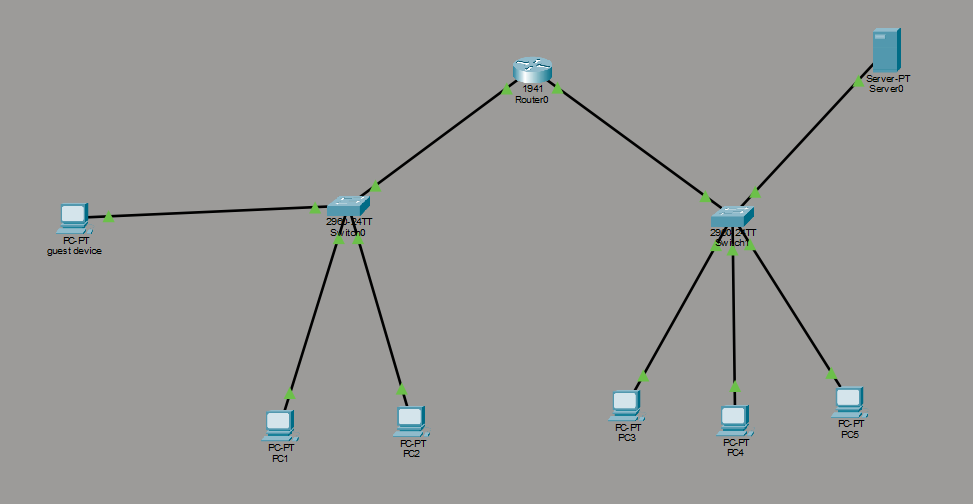
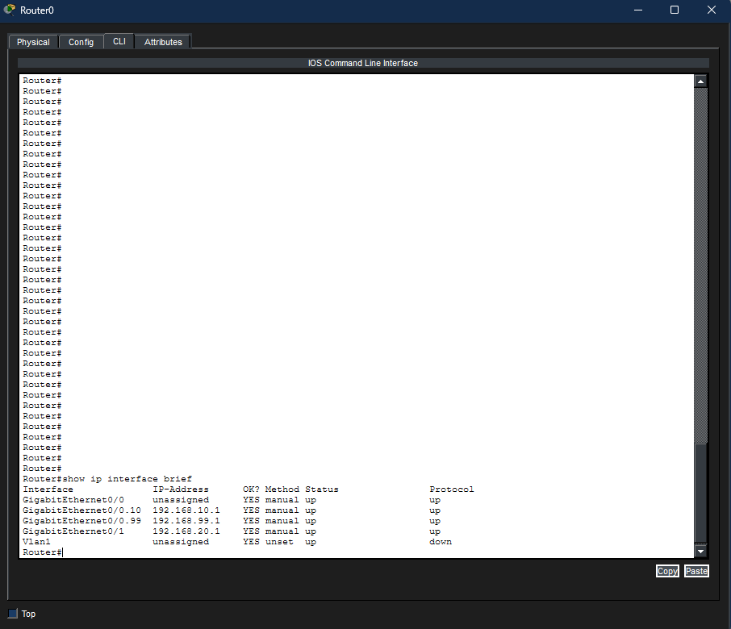
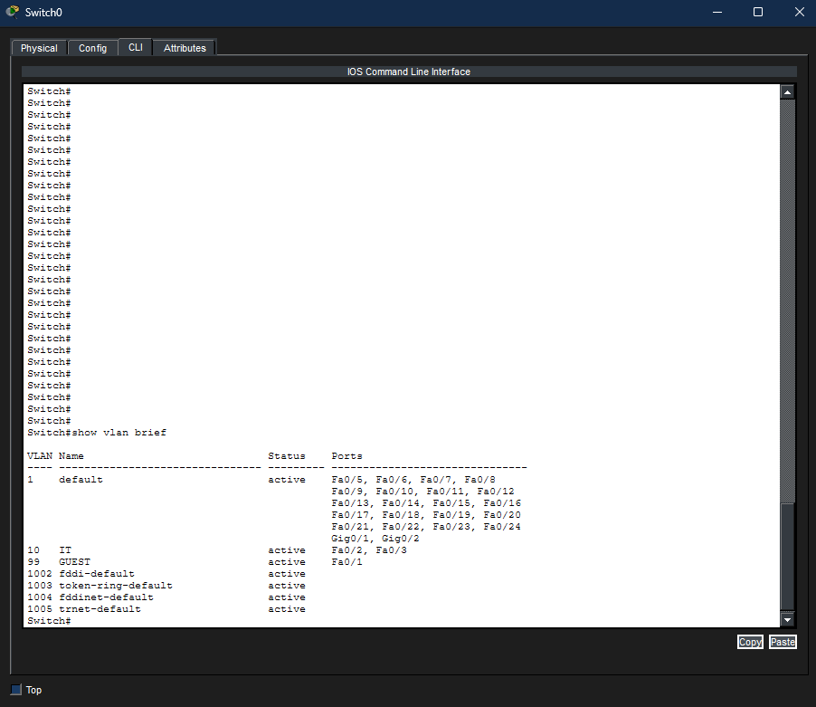
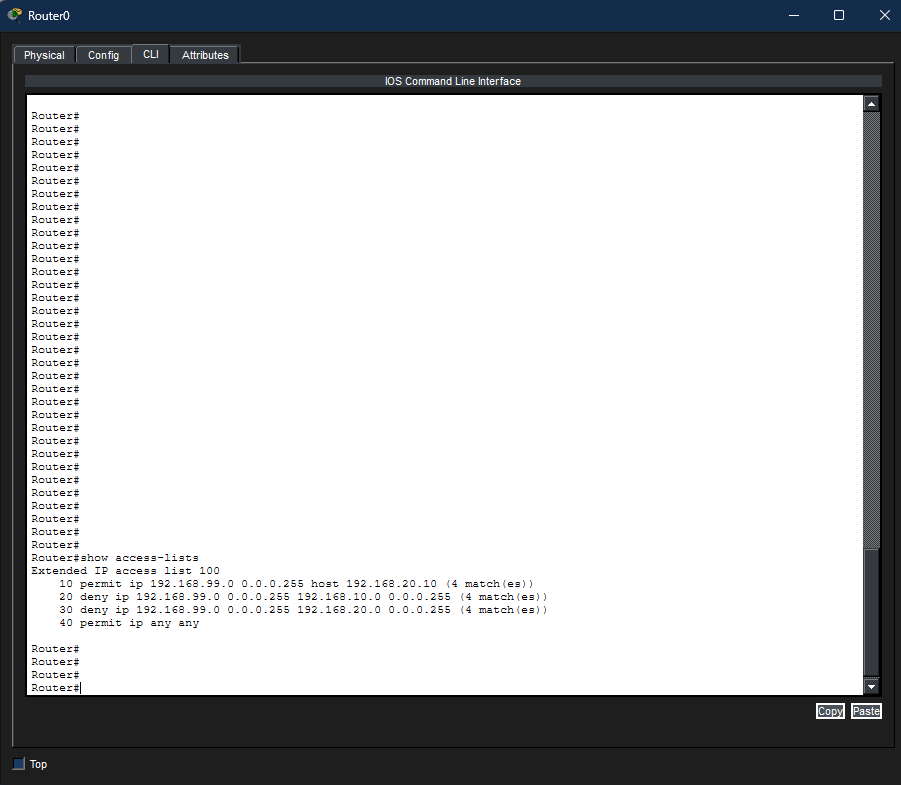
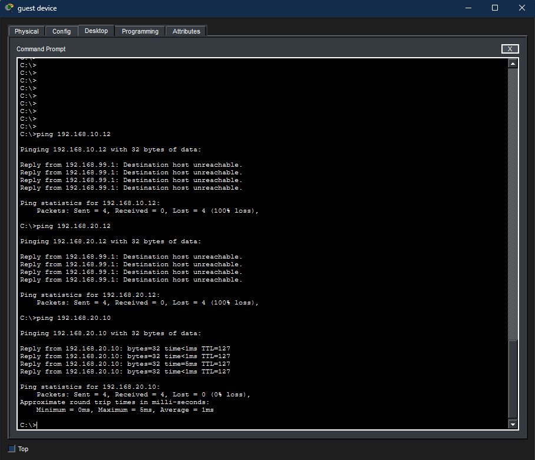
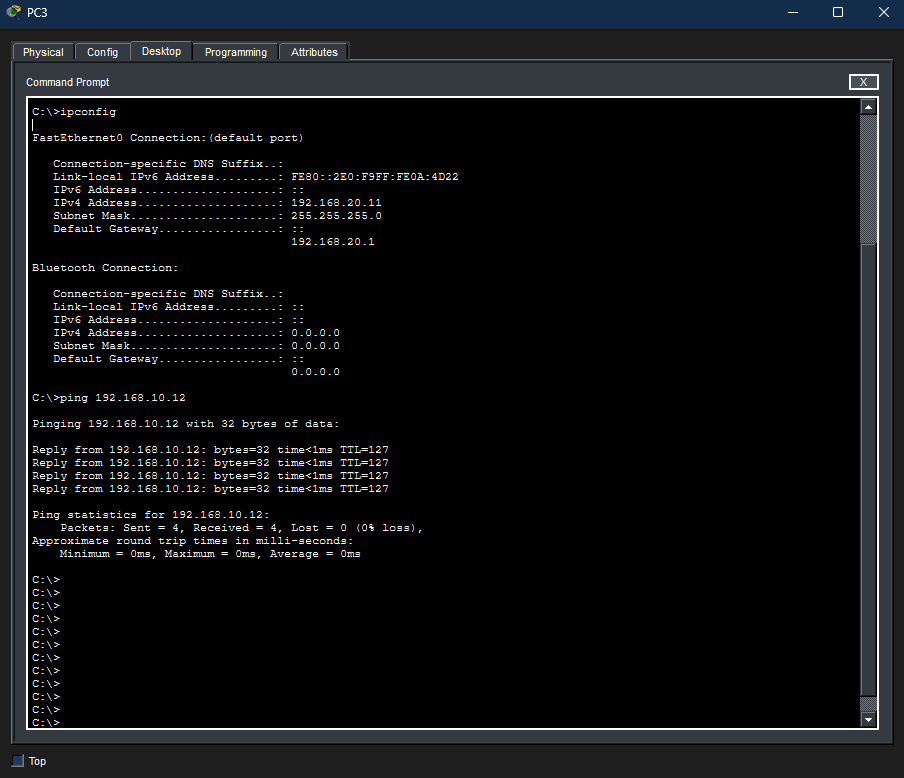
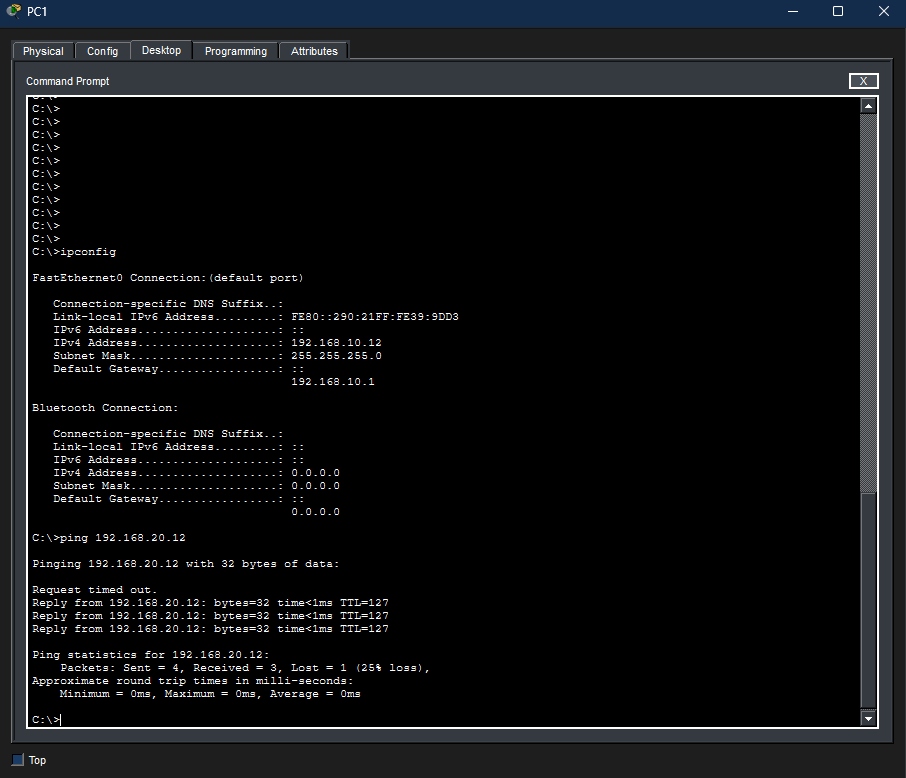
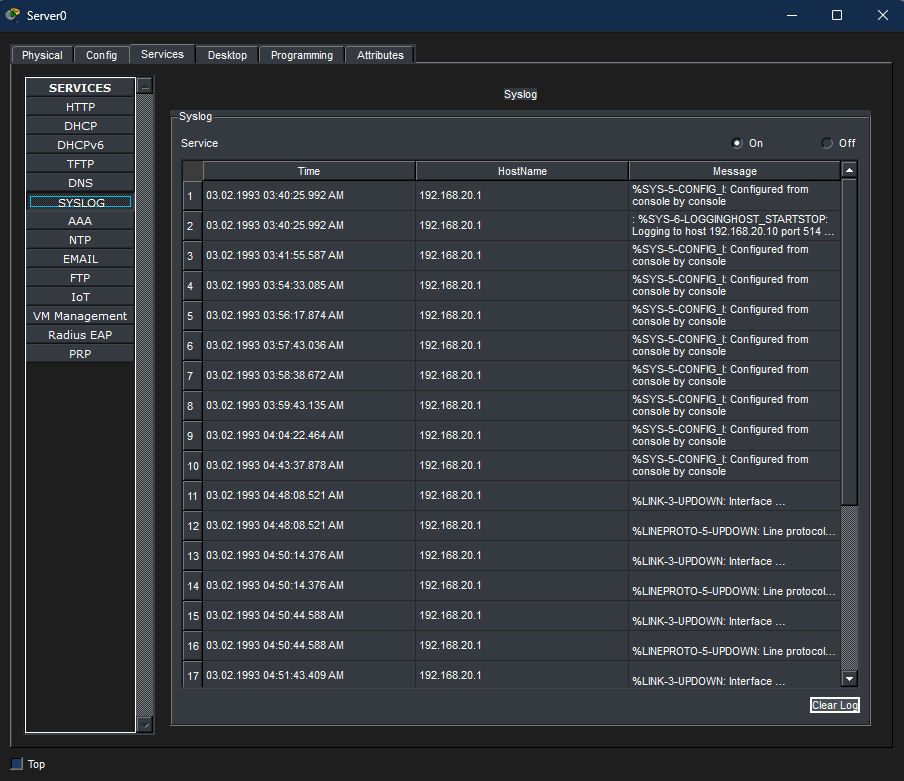

# VLAN Network Segmentation with ACL Enforcement and Syslog Logging

Cisco Packet Tracer project. Three departments (Guest, IT, Sales) share the same physical switches and router, but only get the network access they're supposed to have. Guest traffic is locked down with an extended ACL, VLANs keep the departments logically separated, and the router ships its logs to a central syslog server.

## Summary

- 2 switches, 1 router, 6 PCs, 1 server
- Guest VLAN can reach the shared server and nothing else
- IT and Sales sit on their own VLANs, with IT keeping open access
- Router-on-a-stick handles inter-VLAN routing on one physical link
- Router activity is logged to a dedicated syslog server

## How I approached it

1. Planned the IP scheme and VLAN layout before touching any device, so I wasn't guessing mid-build.
2. Built the physical topology: two switches, one router, PCs and a server cabled in.
3. Created VLANs 10 (IT), 20 (Sales), and 99 (Guest), and assigned switch ports accordingly.
4. Set up router-on-a-stick on the link between Switch0 and the router, since that link carries two VLANs (IT and Guest) and needed subinterfaces with 802.1Q tagging. The link to the Sales switch only carries one VLAN, so it stayed a plain routed connection, no subinterfaces needed there.
5. Wrote an extended ACL to lock Guest traffic down to the server only, and applied it to the router.
6. Configured the router to send its logs to the server, running the syslog service.
7. Tested every path I expected to work and every path I expected to be blocked, not just the happy path.
8. Along the way I hit a real bug (detailed below) where the ACL existed but wasn't actually filtering anything, and had to figure out why.

## Topology



## IP Addressing

| Device | VLAN | IP Address | Subnet Mask | Gateway |
|---|---|---|---|---|
| guest device | 99 | 192.168.99.11 | 255.255.255.0 | 192.168.99.1 |
| PC1 (IT) | 10 | 192.168.10.12 | 255.255.255.0 | 192.168.10.1 |
| PC2 (IT) | 10 | 192.168.10.13 | 255.255.255.0 | 192.168.10.1 |
| PC3 (Sales) | 20 | 192.168.20.11 | 255.255.255.0 | 192.168.20.1 |
| PC4 (Sales) | 20 | 192.168.20.12 | 255.255.255.0 | 192.168.20.1 |
| PC5 (Sales) | 20 | 192.168.20.13 | 255.255.255.0 | 192.168.20.1 |
| Server | 20 (shared with Sales) | 192.168.20.10 | 255.255.255.0 | 192.168.20.1 |
| Router | 10 | Gig0/0.10, 192.168.10.1 | 255.255.255.0 | - |
| Router | 99 | Gig0/0.99, 192.168.99.1 | 255.255.255.0 | - |
| Router | 20 | Gig0/1, 192.168.20.1 | 255.255.255.0 | - |

## Router Configuration (full running-config)

```
version 15.1
service timestamps log datetime msec
no service timestamps debug datetime msec
no service password-encryption
!
hostname Router
!
ip cef
no ipv6 cef
!
license udi pid CISCO1941/K9 sn FTX1524K7QP-
!
spanning-tree mode pvst
!
interface GigabitEthernet0/0
 no ip address
 duplex auto
 speed auto
!
interface GigabitEthernet0/0.10
 encapsulation dot1Q 10
 ip address 192.168.10.1 255.255.255.0
!
interface GigabitEthernet0/0.99
 encapsulation dot1Q 99
 ip address 192.168.99.1 255.255.255.0
 ip access-group 100 in
!
interface GigabitEthernet0/1
 ip address 192.168.20.1 255.255.255.0
 duplex auto
 speed auto
!
interface Vlan1
 no ip address
!
ip classless
!
ip flow-export version 9
!
access-list 100 permit ip 192.168.99.0 0.0.0.255 host 192.168.20.10
access-list 100 deny ip 192.168.99.0 0.0.0.255 192.168.10.0 0.0.0.255
access-list 100 deny ip 192.168.99.0 0.0.0.255 192.168.20.0 0.0.0.255
access-list 100 permit ip any any
!
logging 192.168.20.10
line con 0
line aux 0
line vty 0 4
 login
end
```

## Switch Configuration

**Switch0 (IT + Guest)** - VLANs 10 and 99, trunked uplink to the router since both VLANs share that one physical link.

**Switch1 (Sales)** - VLAN 20 only, plain access link to the router since only one VLAN needs to cross it.

Full `show vlan brief` output for both is in the screenshots below.

## What the ACL does

```
access-list 100 permit ip 192.168.99.0 0.0.0.255 host 192.168.20.10
access-list 100 deny ip 192.168.99.0 0.0.0.255 192.168.10.0 0.0.0.255
access-list 100 deny ip 192.168.99.0 0.0.0.255 192.168.20.0 0.0.0.255
access-list 100 permit ip any any
```

Line by line: allow the Guest subnet to reach the server specifically, deny the Guest subnet from reaching IT, deny the Guest subnet from reaching the rest of the Sales/server subnet, then allow everything else so traffic that has nothing to do with the Guest VLAN isn't accidentally blocked. Applied inbound on the Guest subinterface, so it's the first thing that happens to Guest traffic the moment it hits the router.

## Test Results

| Test | Result | Notes |
|---|---|---|
| Guest to Server (192.168.20.10) | Allowed | 4/4 replies |
| Guest to IT (192.168.10.x) | Blocked | ACL deny, destination unreachable from gateway |
| Guest to other Sales hosts | Blocked | ACL deny, destination unreachable from gateway |
| Sales (PC3) to IT (PC1, 192.168.10.12) | Allowed | 4/4 replies, confirms no ACL restricts Sales traffic |
| IT (PC1) to Sales (PC4, 192.168.20.12) | Allowed | 3/4 replies, one lost packet from normal ARP delay on first ping |
| Router to syslog server | Delivered | Config-change and interface events logged with timestamps |

## Screenshots

Topology:


Router interface summary (`show ip interface brief`):


Switch0 VLAN summary, IT and Guest (`show vlan brief`):


Switch1 VLAN summary, Sales (`show vlan brief`):


ACL rules and hit counters (`show access-lists`):


Guest ping tests, allowed and blocked:


PC3 (Sales) ping test to PC1 (IT):


PC1 (IT) ping test to PC4 (Sales):


Syslog server log entries:


## Troubleshooting: ACL was configured but not filtering anything

Early in testing, Guest VLAN devices could reach networks they were supposed to be blocked from, even though the ACL was already written.

**Checked the ACL itself first:**
```
show access-lists
```
The rules were there and correct: permit Guest to the server, deny Guest to IT, deny Guest to the rest of the Sales subnet, permit everything else.

**Checked whether the ACL was actually applied to an interface:**
```
show running-config | include access-group
```
Nothing came back. The ACL existed but wasn't attached to anything.

**Root cause:** writing an ACL only defines the rule set. It has no effect until it's applied to a specific interface, in a specific direction, with `ip access-group`.

**Fix:**
```
interface GigabitEthernet0/0.99
 ip access-group 100 in
```

**Confirmed the fix worked** by re-running the same three ping tests (Guest to server, Guest to IT, Guest to Sales) and checking `show access-lists` for hit counters against each rule.

## Other things worth noting

- Packet Tracer's simulated IOS doesn't reliably generate syslog entries for individual ACL matches, even with the `log` keyword on a rule. Real Cisco hardware does this consistently. I verified ACL behavior with `show access-lists` hit counters and direct ping tests instead of relying on per-match log entries.
- `logging trap informational` didn't behave consistently in the simulator either, so logging was left at its default trap level.

## Why this matters

This is the same pattern behind guest Wi-Fi in any office: a device gets on the network without getting access to anything internal. IT staying open while Guest and Sales get scoped down is a basic least-privilege setup, give people and devices only the access they actually need.

From a security testing angle, the bug I hit (an ACL that existed but was never applied) is a realistic finding. Networks that look segmented on paper but aren't actually enforcing it are a common gap in real environments, and this is exactly what that looks like from the inside.

## What I learned

- An ACL isn't active until it's applied to an interface with a direction. Writing the rule is half the job.
- VLANs separate broadcast domains at Layer 2. Actual enforcement of who can talk to whom happens at Layer 3, with routing and ACLs.
- Router-on-a-stick only needs subinterfaces on links that carry more than one VLAN. A link with a single VLAN can stay a plain access connection.
- ACL rule order matters. Rules are checked top to bottom and the first match wins, so a broad permit placed above a specific deny makes that deny pointless.
- Syslog centralizes visibility into what a device is doing. Even with the limitations of a simulator, pointing a router at a log server is the same core idea used in real monitoring setups.
- Don't assume a failed ping means what you expect. A timeout can mean an ACL block, a bad route, or a target that just isn't live. Confirming with `show running-config` instead of guessing is what actually resolved the open question in this project.

## Files in this repo

- `segmented-network-acl-syslog.pkt` - Packet Tracer project file
- `configs/router-running-config.txt` - full router running-config
- `screenshots/` - topology, VLAN summaries, interface summary, ACL verification, ping tests, syslog output
